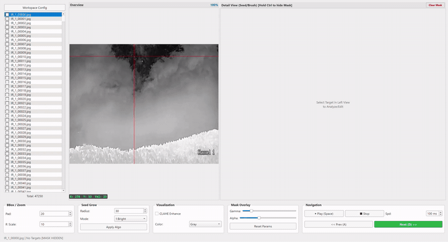
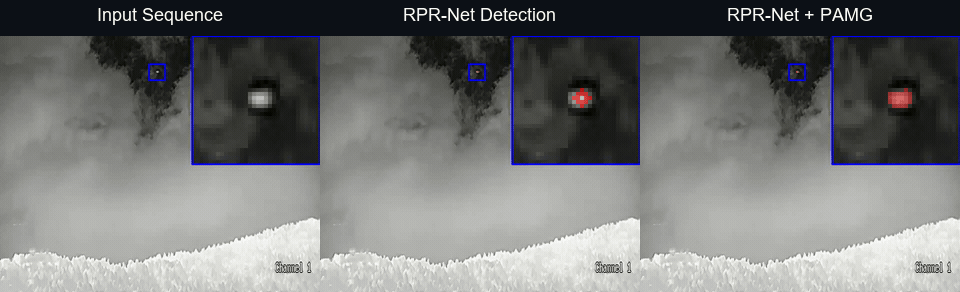

# Point2Mask

Point-to-Mask: A Two-Stage Framework for Infrared Small Target Detection with Arbitrary Point Supervision 论文中 PAMG 与 RPR-Net 的官方实现，用于任意单点监督的红外弱小目标检测。如果您觉得本论文、数据集或代码对您有帮助，请为本仓库点一个 Star，作者在此表示诚挚感谢！

> **研究用途声明：**代码和公开权重仅允许用于非商业学术研究与教学。
> 商业使用必须另行取得作者书面许可，详见 [LICENSE](LICENSE)。

RPR-Net 使用时间差分注意力（Temporal Difference Attention，TDA）从连续红外帧中预测目标中心点与半径，并支持两种掩膜生成方式：

- `radius`：根据预测中心点和半径直接绘制半径掩膜。
- `pamg`：将预测中心点作为 PAMG 种子，并将预测半径转换为论文中的 PAMG 生长先验 `Rs`，生成自适应掩膜。

仓库同时提供带 PAMG 辅助生成功能的交互式标注软件 Label-IRST。

[English](README.md)

## 论文

**W. Gao et al., "Point-to-Mask: A Two-Stage Framework for Infrared Small Target Detection with Arbitrary Point Supervision," in IEEE Transactions on Geoscience and Remote Sensing, doi: 10.1109/TGRS.2026.3730901.**

[[IEEE Xplore](https://ieeexplore.ieee.org/document/11683233/)] [[DOI](https://doi.org/10.1109/TGRS.2026.3730901)]

## 演示

### Label-IRST 标注与 PAMG 辅助掩膜生成

<p align="center">
  
</p>

### 同步序列对比

<p align="center">
  
</p>

## 发布内容

- PAMG 点到掩膜算法
- RPR-Net 网络与损失函数
- 监督训练脚本
- 单个时序序列和数据集推理
- 半径掩膜以及 RPR-Net + PAMG 掩膜生成
- Label-IRST 标注软件
- SIRSTD 数据集训练的官方模型权重
- Label-IRST、RPR-Net 和 PAMG 的演示

## 安装

建议使用 Python 3.9 或更新版本。

```bash
python -m pip install -r requirements.txt
```

## 官方权重

| 模型 | 文件 | SHA-256 |
|---|---|---|
| SIRSTD 上的 RPR-Net | `weights/rprnet_sirstd_v1.pth` | `D3CC256E02B93B56569A7BE604886573928CEAD3C6482F6801DAE29AAA333F32` |


## 快速推理

输入按时间排列的三帧图像，中间一帧为待处理帧。

半径掩膜：

```bash
python RPRNet/tools/inference_rprnet.py \
  --images frame_0001.png frame_0002.png frame_0003.png \
  --mode radius \
  --output-dir outputs/radius
```

RPR-Net + PAMG：

```bash
python RPRNet/tools/inference_rprnet.py \
  --images frame_0001.png frame_0002.png frame_0003.png \
  --mode pamg \
  --output-dir outputs/pamg
```

每次运行会保存 `detections.csv` 和生成的二值掩膜。

对数据集测试列表进行批量推理时，不会读取真实掩膜：

```bash
python RPRNet/tools/inference_rprnet.py \
  --sample-list dataset/SIRSTD/splits/test.txt \
  --image-root dataset/SIRSTD/images \
  --mode pamg \
  --output-dir outputs/test_predictions
```

列表中的样本名应采用 SIRSTD 格式，例如 `IR_2_00000`。

## 基础训练

RPR-Net 在训练过程中直接读取二值 mask，并在线生成 heatmap 和回归监督：

先在 `RPRNet/configs/rprnet_sirstd.py` 中设置模型、在线标签、损失函数和优化超参数，然后运行：

```bash
python -u RPRNet/tools/train_rprnet.py \
  --train-list dataset/SIRSTD/splits/train.txt \
  --image-root dataset/SIRSTD/images \
  --mask-root dataset/SIRSTD/masks \
  --save-dir outputs/rprnet_train
```

训练列表每行填写一个不含绝对路径的 SIRSTD 格式样本名。图像和 mask
使用相同样本名，例如 `images/IR_2_00000.jpg` 与 `masks/IR_2_00000.png`。
`checkpoint_last.pth` 保存模型、优化器、学习率调度器和 epoch，用于断点续训；`rprnet_epoch_XXXX.pth` 仅保存模型参数，用于推理。

断点续训命令：

```bash
python -u RPRNet/tools/train_rprnet.py \
  --train-list dataset/SIRSTD/splits/train.txt \
  --image-root dataset/SIRSTD/images \
  --mask-root dataset/SIRSTD/masks \
  --save-dir outputs/rprnet_train \
  --resume outputs/rprnet_train/checkpoint_last.pth
```

推理脚本不读取训练配置。模型、批大小、阈值、Top-K、原始输出保存和 PAMG
等推理参数都集中在 `RPRNet/tools/inference_rprnet.py` 顶部的
`Editable inference settings` 区域，可直接打开推理脚本修改并独立运行。
PAMG 推理设置包括 `PAMG_RS_SCALE`、`PAMG_RS_CAP` 和 `PAMG_POLARITY`。数据集推理只读取图像和样本列表，不读取真实 mask。

## Label-IRST

```bash
python labelSIRST/sirst_mask_labeler.py
```

Label-IRST 由左侧的全图窗口（Overview）和右侧的局部编辑窗口（Detail View）组成。左侧用于浏览图像及选择目标区域，右侧用于运行 PAMG、补画或擦除 mask。两个窗口的十字光标同步，并显示当前像素坐标和灰度值。

如果您觉得功能有待完善，欢迎提出更改。以下是现有版本的操作说明：

### 工作目录

软件启动后需要配置以下目录：

- **Images Dir**：待标注图像目录，支持 `.jpg`、`.png`、`.bmp` 和 `.tif`。
- **Masks Dir**：mask 读取和保存目录。已有同名 mask 时会自动载入，否则从空 mask 开始。mask 始终以与图像主文件名相同的 `.png` 文件保存。为避免输入图像被覆盖，请勿将该目录设置为图像目录。
- **Labels Dir (Optional)**：可选的 YOLO bounding box 标注目录。每张图像对应一个同名 `.txt` 文件，程序读取标准 YOLO 格式中的归一化中心坐标和宽高，用于初始化右侧局部编辑区域。该目录留空或没有对应标注时，可在左侧窗口手动创建区域。

目录设置保存在当前工作目录的 `labeler_config.json` 中，下次启动时会自动载入；该文件已被 Git 忽略。运行期间可以通过 **Workspace Config** 重新选择目录，重新配置前建议先保存当前 mask。

### 基本使用流程

1. 在左侧文件列表中选择图像。若提供了 YOLO 标注，程序会自动生成目标框；否则在左侧全图窗口按住 `Ctrl` 并用左键拖出目标区域。
2. 单击目标框将其选中，右侧窗口会显示对应的局部放大图。存在多个目标框时，可按 `Tab` 依次切换。
3. 在 **Seed Grow** 中设置 `Rs` 和目标极性模式，然后单击 **Apply Algo** 使参数生效。
4. 在右侧窗口按住 `Shift` 并单击目标点，PAMG 会生成初始 mask，并与当前 mask 合并。
5. 使用左键画笔补充前景、右键画笔擦除误标区域，完成后按 `Ctrl+S` 保存。

切换图像或退出软件时也会自动保存当前 mask。文件列表中的 `✅` 表示已保存非空 mask，`⚠️` 表示已保存空 mask，`⬜` 表示尚无对应 mask 文件，`❓` 表示状态仍在检查。

### 鼠标操作

| 操作区域 | 鼠标操作 | 功能 |
|---|---|---|
| 左侧全图窗口 | 左键单击目标框 | 选中目标框并在右侧显示对应区域 |
| 左侧全图窗口 | 左键拖动 | 平移全图 |
| 左侧全图窗口 | `Ctrl + 左键拖动`空白区域 | 新建目标框 |
| 左侧全图窗口 | `Ctrl + 左键拖动`目标框内部 | 移动目标框 |
| 左侧全图窗口 | `Ctrl + 左键拖动`目标框边缘或控制点 | 调整目标框大小 |
| 左侧全图窗口 | 右键单击目标框 | 打开菜单，可选择 **Delete BBox** 删除目标框 |
| 左侧全图窗口 | `Ctrl + 滚轮` | 以鼠标位置为中心缩放全图 |
| 右侧局部窗口 | `Shift + 左键单击` | 以点击位置为种子运行 PAMG，并把结果加入当前 mask |
| 右侧局部窗口 | 左键单击或拖动 | 使用画笔添加前景 |
| 右侧局部窗口 | 右键单击或拖动 | 使用画笔擦除前景 |
| 右侧局部窗口 | 滚轮 | 调整画笔大小 |
| 右侧局部窗口 | `Ctrl + 滚轮` | 调整局部图像放大倍数 |

### 快捷键

| 快捷键 | 功能 |
|---|---|
| `A` | 上一张图像；播放时按下会停止播放 |
| `D` | 下一张图像；播放时按下会停止播放 |
| `Tab` | 循环选择当前图像中的目标框 |
| `Space` | 播放或暂停图像序列 |
| `Delete` | 删除当前目标框 |
| `Ctrl+S` | 保存当前 mask |
| `Ctrl+C` | 清空当前 mask |
| `Ctrl+Z` | 撤销最近一次 mask 操作 |
| `Ctrl+Shift+Z` | 撤销最近一次目标框操作 |
| 按住 `Ctrl` | 临时隐藏 mask 覆盖层，松开后恢复显示 |

mask 和目标框分别保存最近 10 次可撤销状态。目标框只用于定位局部编辑区域；手动新建、移动、缩放或删除目标框不会写回 YOLO `.txt` 文件。

### 参数与显示

- **Pad**：为从 YOLO 标注载入的目标框增加上下文边界；修改后会根据原始 YOLO 标注重新计算目标框。
- **R-Scale**：右侧局部窗口的放大倍数，也可通过 `Ctrl + 滚轮`调整。
- **Rs**：PAMG 的生长尺度先验。
- **Mode**：目标极性，`1:Bright` 表示亮目标，`-1:Dark` 表示暗目标，`0:Auto` 表示自动判断。修改 `Rs` 或 Mode 后需要单击 **Apply Algo**。
- **CLAHE Enhance**：仅增强显示对比度，不修改原图或保存的 mask。
- **Color**：在 Gray、JET 和 OCEAN 显示模式之间切换，不影响保存结果。
- **Gamma / Alpha**：调整 mask 覆盖层的显示强度和透明度，不修改 mask 数值。
- **Reset Params**：恢复 PAMG、画笔和显示参数的默认值。
- **Play / Stop / Spd**：播放、停止图像序列并设置相邻帧的播放间隔，单位为毫秒。
- **Clear Mask**：清空当前 mask；该操作可以使用 `Ctrl+Z` 撤销。

## SIRSTD 数据集

SIRSTD 包含 47,250 帧红外图像。

- 数据集文件：`SIRSTD-Pixel.zip`
- 下载地址：[百度网盘](https://pan.baidu.com/s/1HCL8RU122I2xT_G7ey331w?pwd=3j72)（提取码：`3j72`）

数据本体不放入 Git 仓库，而是使用单独的 [CC BY-NC 4.0 数据集许可](DATASET_LICENSE.md)发布。

请将数据集解压或复制到仓库中的占位目录：

```text
dataset/SIRSTD/
  images/
    IR_2_00000.jpg
  masks/
    IR_2_00000.png
  YOLO_labels/
    IR_2_00000.txt
  splits/
    train.txt
    test.txt
```

`YOLO_labels` 保存标准 YOLO 格式的 bounding box 标注。负样本可以使用空标注文件，也可以不提供对应标注文件。划分文件每行填写一个样本名，例如 `IR_2_00000`。

## 项目结构

```text
./
  RPRNet/
    configs/          可编辑的训练超参数
    datasets/         时序帧读取与在线 mask 监督
    nets/             RPR-Net 与训练损失
    tools/            训练及统一的序列/数据集推理
    utils/            解码、掩膜生成和检查点读写
  dataset/SIRSTD/     本地数据集占位目录（图像、mask、YOLO 标注和划分文件）
  labelSIRST/         PAMG 与 Label-IRST
  weights/            官方模型参数
  README.md
  DATASET_LICENSE.md
  LICENSE
  requirements.txt
```

## 引用

如果您在研究中使用了本仓库的数据集或代码，必须引用以下论文：

```bibtex
@ARTICLE{11683233,
  author={Gao, Weihua and Niu, Wenlong and Tang, Jie and Yang, Man and Zhang, Jiafeng and Peng, Xiaodong and Zhan, Yang},
  journal={IEEE Transactions on Geoscience and Remote Sensing},
  title={Point-to-Mask: A Two-Stage Framework for Infrared Small Target Detection with Arbitrary Point Supervision},
  year={2026},
  volume={},
  number={},
  pages={1-1},
  doi={10.1109/TGRS.2026.3730901}}
```

## 许可证

代码和模型权重使用自定义的
[Point2Mask 仅限研究、禁止商业使用许可证](LICENSE)。仅允许在非商业研究中修改和再发布，且必须沿用相同许可证并保留作者与论文引用信息。该许可证不是 OSI 认可的开源许可证。

SIRSTD 数据集单独使用 [CC BY-NC 4.0 许可](DATASET_LICENSE.md)。该数据集许可仅适用于数据集，不替代上述代码与模型权重许可。
